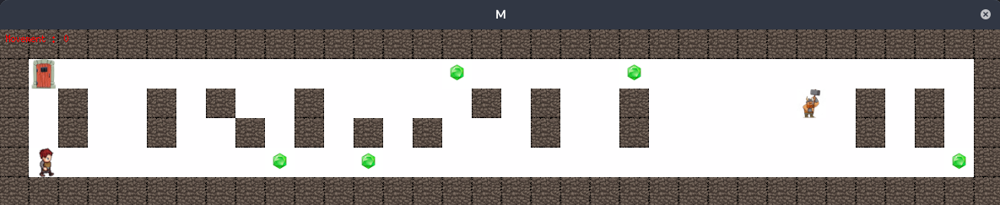

# So Long - Projet Jeu 2D - 42

**So Long** est un jeu vidéo en 2D développé dans le cadre du projet **So Long** de l'école 42. Ce projet a été conçu pour développer des compétences en gestion de mémoire, en utilisation de la bibliothèque graphique [MiniLibX](https://github.com/42Paris/minilibx) et en conception de jeux simples en utilisant des concepts comme les événements et l'affichage graphique.

## Description

So Long est un jeu d'aventure en 2D où le joueur incarne un personnage qui doit naviguer dans un environnement 2D. L'objectif principal est d'atteindre une sortie apres avoir collecter des objets.

Le jeu est développé en C et utilise la bibliothèque **MiniLibX** pour le rendu graphique. Ce projet met en œuvre des concepts fondamentaux tels que la gestion des événements clavier, la gestion de la fenêtre graphique et l'affichage d'images.

## Installation

### Prérequis

Avant de pouvoir exécuter le jeu, assurez-vous que vous avez les prérequis suivants installés :

- **Make** : Pour compiler le projet.
- Un compilateur C compatible avec le standard C99.

### Cloner le projet

Clonez le projet dans votre répertoire local avec la commande suivante :

  ```bash
  git clone https://github.com/Herimamy12/so_long.git
  ```

Accedez au dossier et compilez le projet en utilisant le Makefile fourni :

  ```bash
	cd so_long
	make
  ```

Pour compiler la partie bonus, utilisez :

  ```bash
	make bonus
  ```

## Utilisation

Pour lancer le jeu, exécutez simplement :

  ```bash
	./so_long <nom_de_la_map.ber>
  ```

## Contribution

Les contributions à ce projet sont les bienvenues ! Si vous souhaitez participer, voici les étapes à suivre :

1. Forkez ce projet.
2. Créez une branche pour chaque fonctionnalité ou correction de bug.
3. Assurez-vous que vos modifications ne cassent pas l'existant et que toutes les fonctionnalités sont correctement testées.
4. Soumettez une Pull Request pour que vos modifications puissent être examinées et fusionnées.

Nous vous encourageons également à ajouter des tests unitaires pour garantir la stabilité du projet et éviter toute régression.

## Remerciements

Merci à l'école 42 pour cette incroyable opportunité d'apprentissage et pour le soutien de la communauté. Un grand merci également à tous ceux qui ont contribué directement ou indirectement à ce projet.

#### Auteurs

- [Herimamy12](https://github.com/Herimamy12)
